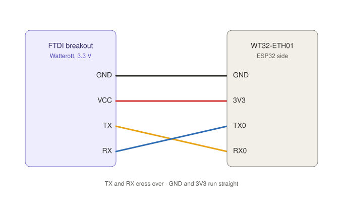
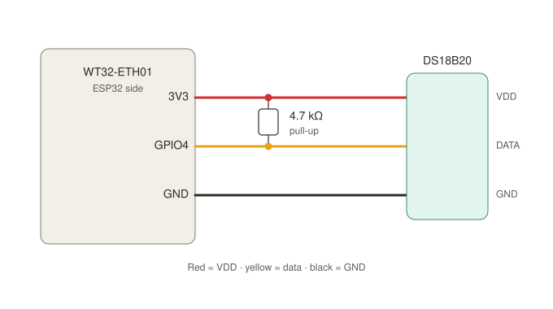
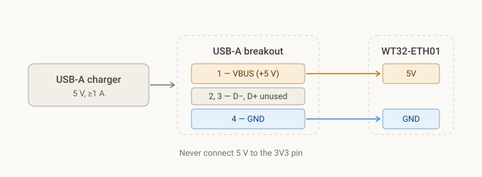
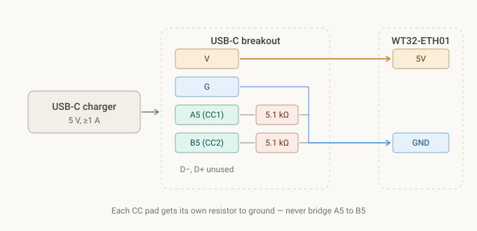
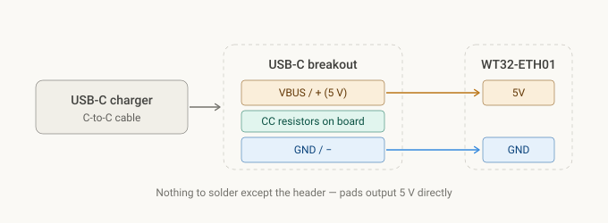

# Temperature Sensor

# Hardware requirements

WT32-ETH01

DS18B20

4\.7k Ω pull-up resistor

either:

* USB-A breakout board
* USB-C breakout board with 2x 5.1kΩ resistors
* USB-C breakout board with pre-soldered 5.1kΩ resistors (recommended)

# Flashing

ESPhome config:

```yaml
# Board: WT32-ETH01 (Wireless-Tag)
# Definition: definitions/boards/wt32-eth01/manifest.yaml

esphome:
  name: temperature
  friendly_name: temperature

esp32:
  variant: esp32
  flash_size: 4MB
  framework:
    type: esp-idf

logger:

api:
  encryption:
    key: "secret"

ota:
  - platform: esphome

ethernet:
  clk:
    mode: CLK_EXT_IN
    pin: GPIO0
  mdc_pin: GPIO23
  mdio_pin: GPIO18
  phy_addr: 1
  power_pin: GPIO16
  type: LAN8720
  
one_wire:
  - platform: gpio
    pin: GPIO4

sensor:
  - platform: dallas_temp
    name: "Temperature"
    update_interval: 30s
    resolution: 12
    filters:
      - filter_out: nan

web_server:
  port: 80
  version: 3
  local: true
```


Initial flashing using `Watterot FTDI breakout reloaded v1.1`

For flashing to work you need to connect a Jumper between `IO0` and `GND`

 

# Wiring

## ESP to Thermometer Sensor

   
The resistor is not inline with the data wire — it bridges across, connecting the data line to 3.3 V. Both dots in the diagram are junctions, not breaks. On a breadboard that means one leg in the row with the yellow wire and the other in the row with the red wire. Place it at the board end of the cable, not at the sensor end. It should pull up the whole length of the line, so it needs to sit near the ESP32 side.

## Power Delivery
### USB-A breakout

 

### USB-C breakout

You can either use a normal usb-c breakout board and solder 2 5.1kΩ resistors to it yourself (selfmade) or you can use a pre-soldered usb-c breakout board.

(Amazon search: “usb-c breakout board 5.1kΩ”)


#### selfmade

 

#### pre-soldered 5.1kΩ

 
